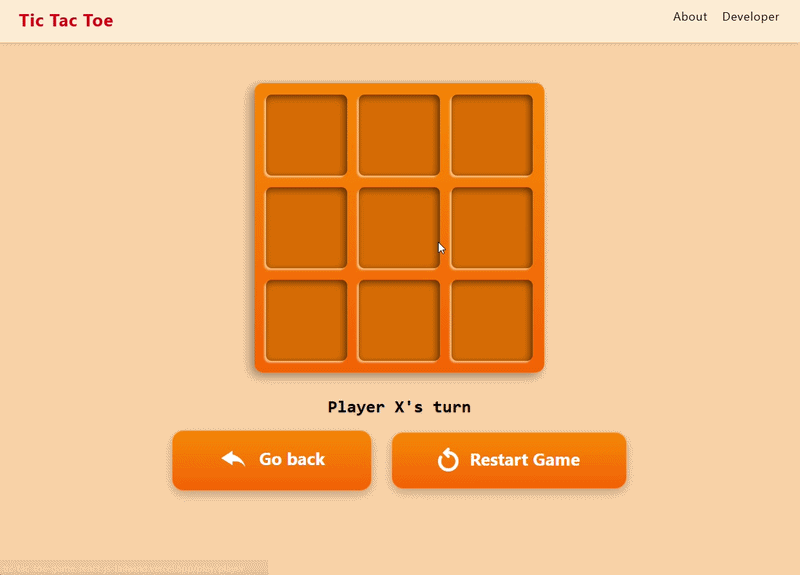
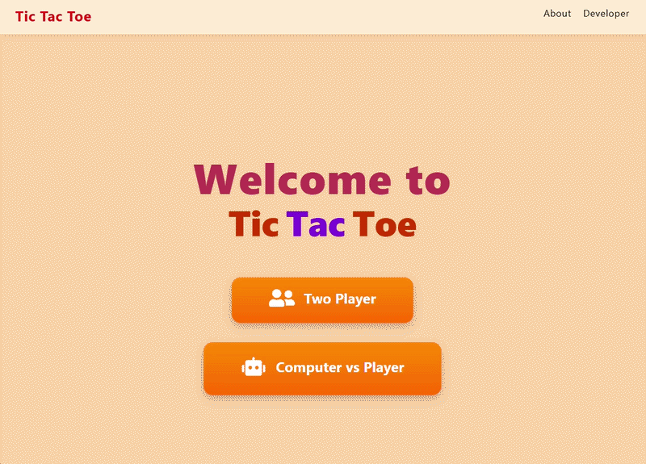

# TicTacToe 🎮

**A fun, sleek, and responsive Tic-Tac-Toe game built with React, Vite, and Tailwind CSS.**  
Play with a friend or challenge the AI powered by the Minimax algorithm 🤖

---

## About TicTacToe

TicTacToe is a modern take on the classic **3×3 grid game**, rebuilt for the web with a beautiful interface and smooth gameplay.

It supports both **Player vs Player (PvP)** and **Player vs AI** modes, allowing you to challenge a friend locally or test your strategy against an AI powered by the Minimax algorithm.

This project demonstrates key React concepts like **state management**, **context**, **component composition**, and **conditional rendering** - all wrapped in an elegant and responsive UI.

---

## Live Demo & Visuals

🎮 **[Play the Live Demo Here](https://tic-tac-toe-game-react-js-tailwind.vercel.app)**

*Here’s a quick look at the game in action:*


Game Playthrough - PvP Mode


Game Playthrough - AI Mode

---

## Key Features

- **Player vs Player Mode:** Two players can take turns on the same device.
- **AI Mode:** Challenge a smart AI opponent powered by the **Minimax algorithm**.
- **Fast & Lightweight:** Built using Vite for instant hot reloads and blazing-fast performance.
- **Clean & Modern UI:** Tailwind CSS ensures a responsive and elegant design.
- **Responsive Layout:** Works smoothly across desktop and mobile devices.
- **Game Restart:** Reset the board anytime to start a new match.

---

## How to Play

1. **Choose Game Mode:** Select between *Player vs Player* or *Player vs AI*.
2. **Take Turns:** Players (or AI) alternate placing “X” and “O” on the grid.
3. **Win or Draw:** The app automatically detects a win or draw.
4. **Restart Anytime:** Click **Restart** to begin a new round.

---

## Getting Started

Follow these steps to run the game locally:

### Prerequisites  
Make sure you have **Node.js (v16+)** and **npm** or **yarn** installed.

### Installation

```bash
git clone https://github.com/Adil-km/TicTacToe-Game.git
cd TicTacToe-Game
npm install
```

### Run Locally

```bash
npm run dev
```

Then open the local URL (usually [http://localhost:5173](http://localhost:5173)) to start playing.

---

## Tech Stack

* **Frontend:** React.js
* **Styling:** Tailwind CSS
* **Bundler:** Vite
* **Language:** JavaScript
* **AI Logic:** Minimax Algorithm

---

## Contact

Want to learn more about this project or connect with the creator?

* [🌐 Portfolio](https://my-portfolio-gamma-nine-79.vercel.app/)
* [💻 GitHub/Adil-km](https://github.com/Adil-km/TicTacToe-Game)
* [🔗 LinkedIn/adil-km](https://www.linkedin.com/in/adil-km)